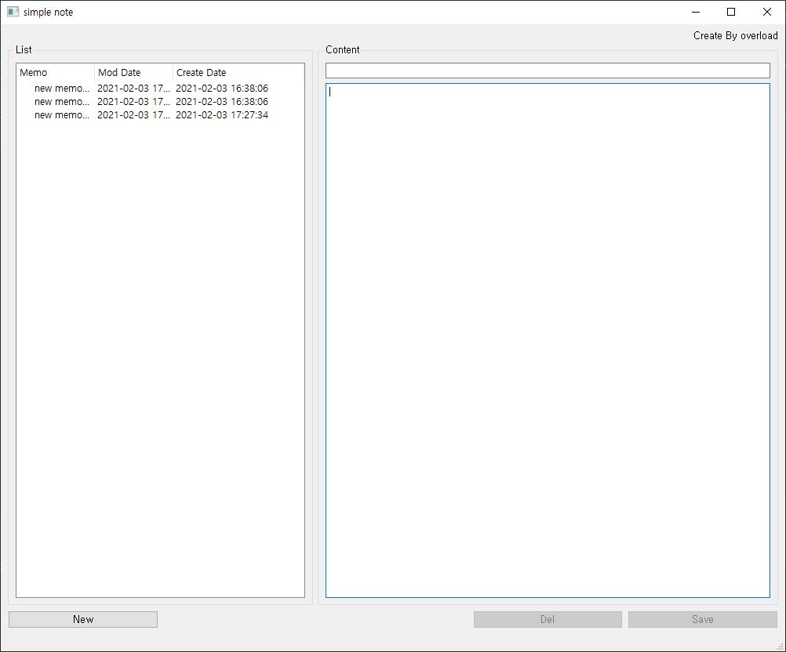

# pyqt_simple_memo
## 1. What is this
</img><br/>
This is a simple Memo App made using PyQt5.
* * *

## 2. What can this app do
Records the date of creation and modification of the memo, and displays a list of memos saved by the app itself.</br>
This program manages memo data in xml standard.</br>
Each memo is given a unique serial using uuid.</br>
The schema of the saved memo is as follows.</br>

```xml
<memos>
    <memo no="a38af062-6771-400c-83b3-ef13676272c5" title="new memo example 1" c_date="2021-02-03 16:38:06" m_date="2021-02-03 17:47:22">
        <content>this is test memo example 1</content>
    </memo>
    <memo no="14096883-949a-4d88-8a70-46f007f68137" title="new memo example 2" c_date="2021-02-03 16:38:06" m_date="2021-02-03 17:47:28">
        <content>this is test memo example 2</content>
    </memo>
    <memo no="cf271045-fe0b-40fa-95ad-eb3171aa03d3" title="new memo example 3" c_date="2021-02-03 17:27:34" m_date="2021-02-03 17:47:34">
        <content>this is test memo example 3</content>
    </memo>
</memos>
```
* * *

## 3. Install required packages
- Python3+ (The version of Python used when making this program is 3.9)
- PyQt (PyQt5)
- Pyinstaller

If you want to build this source, run this command in your project's directory.
<pre><code>pyinstaller --onefile --windowed main.py</code></pre>